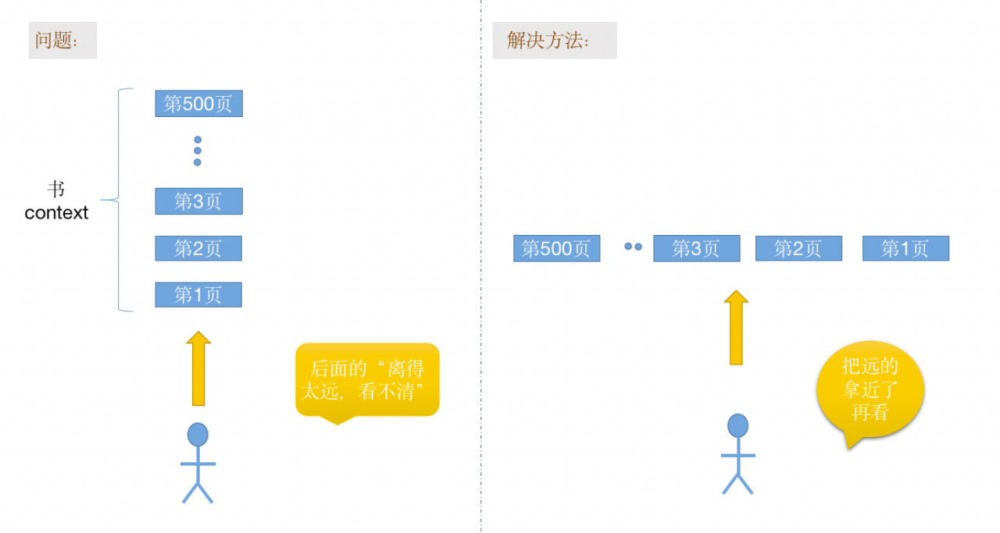
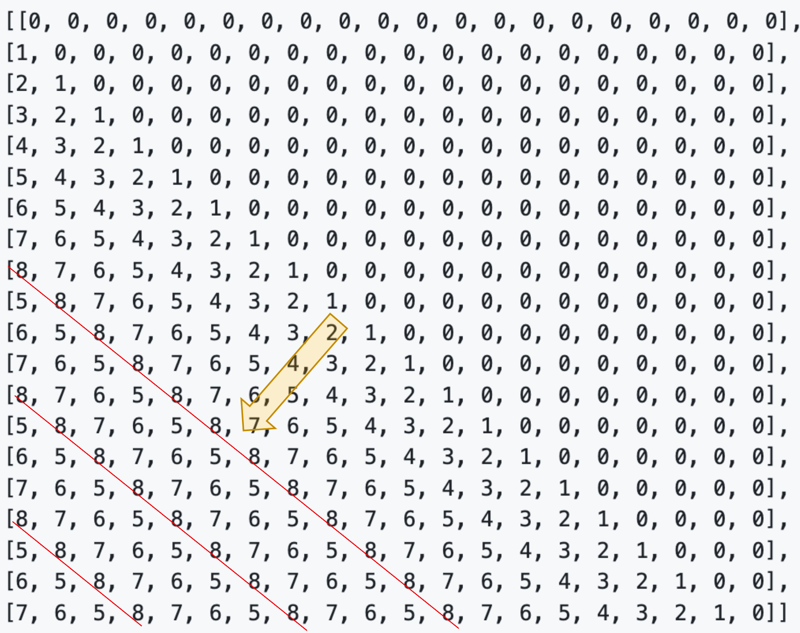

# weave

## weave设计思路

### 外推的设计原则：
attention score需要被bound住。也就是外推部分的位置编码和W^q, W^k能够配合起来。

在此，区分下token和位置编码。因为可以做如下推断：相同的语句“我爱番茄”，出现在视野内的位置，它的attention score可以bound住，但是视野外的位置，大概率是会超出有效区域的。因此，这里强调的是，位置编码和W^q, W^k能够配合起来。

考虑到我们训练LLM，总是会存在一个训练的最大长度，这个最大长度也可以认为是最大视野。
那么总会有超出视野的部分。而超出视野的位置如何编码成为关键。

### 设计思路
一个想法是，超出视野，相当于距离的太远。比如我们在看一本书。后面的章节部分离眼睛太远，那么怎么解决呢？最直接的就是把后面的章节部分拿近一些再看。

考虑此，可以将后面的章节拿近了再看。
效果示意图：

### 设计实现
"将后面的章节拿近"，在位置编码层面来看，可以考虑将这些章节的位置编码排成一样的。比如，以最后一个token看到的相对位置编码为例：
[700,699,,,500,700,699,,,500,700,699,,,500,499,,,0]
相当于700-500的位置编码为一个章节。把这些章节都并排起来。

对应attention score矩阵的位置编码示意图：

当然，这种编码方式，比较巧合的是，当我们把weave的长度设置为1时，这种注意力矩阵就会退化为ReRoPE。
从这个角度来说，ReRope似乎是它的一个特例。

希望大家仁者见仁，智者见智，进一步通过这些不同的方法，来更深刻地理解位置编码的含义吧。

### 进一步工作

##### 1.改进推理速度，减少内存消耗，放在version 2。
##### 2.应用到alibi的外推。目前测试发现，baichuan模型，尽管外推的ppl值较好，但passkey任务仅在2k以内。

